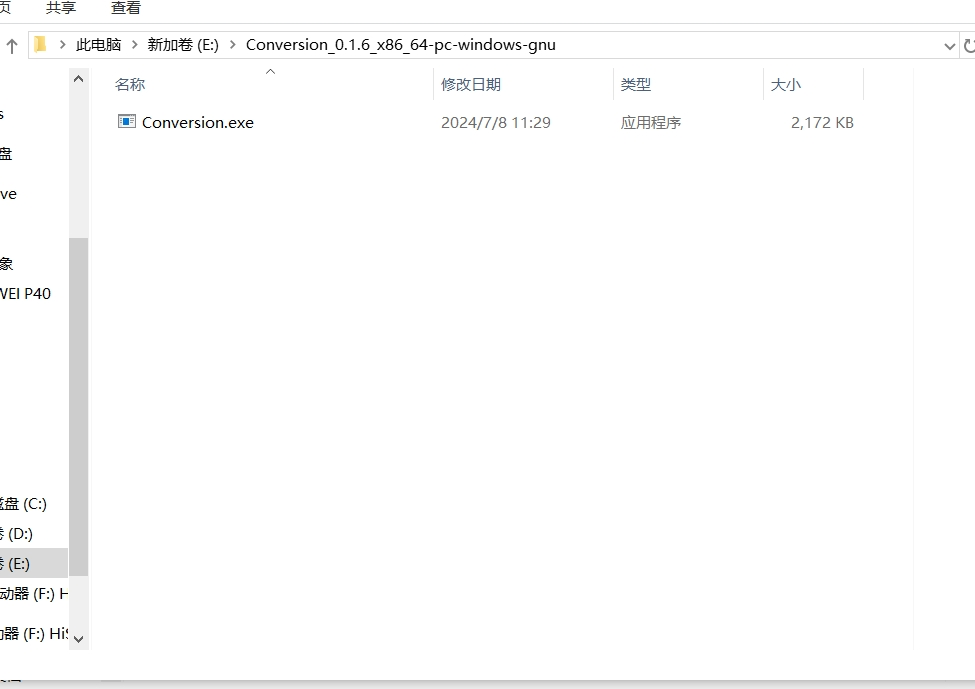
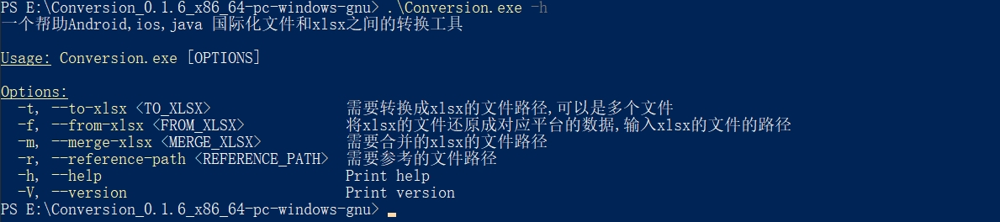
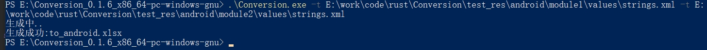
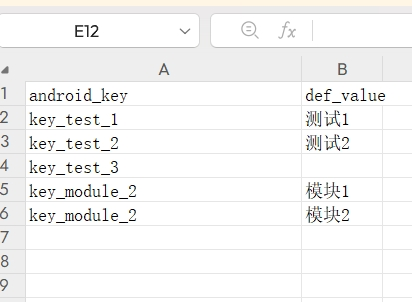
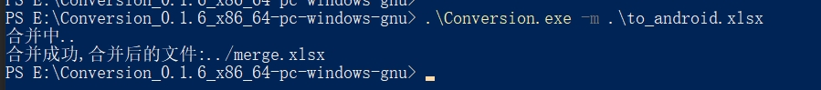
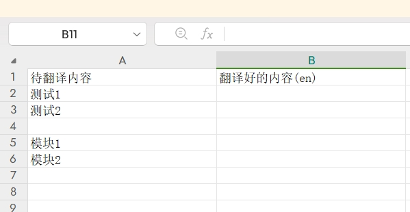
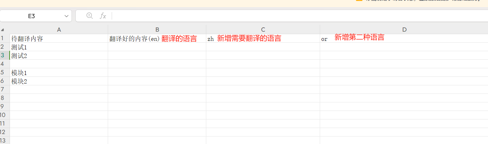
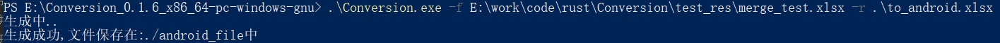
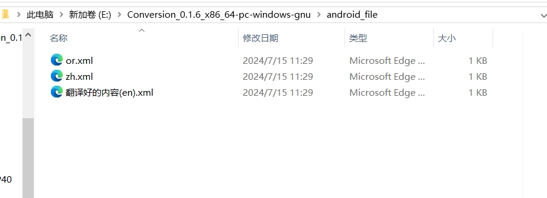
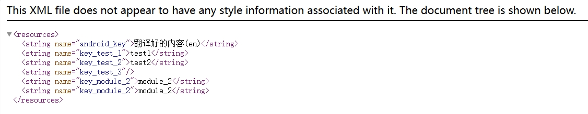

# Conversion

Conversion是一个帮助android,ios,java生成国际化文件的工具

# 背景

当项目需要国际化的时候,一般需要专门的翻译人员来进行翻译,但是

* Android是strings.xml文件
* ios是Localizable.strings文件
* java是messages.properties文件

每个平台的文件格式都不一样,所有就需要每个平台自己将需要的文件,整理到excel表格中,然后将excel表格交给翻译人员,等翻译好以后,再又每个平台自己根据表格中的翻译,手动生成对应平台的文件,放到相应的位置

# 原理

1. 依次读取每个平台的待翻译语言文件,生成表格,记录下每个待翻译文本的平台对应的key
2. 合并每个平台生成的表格,去除重复的待翻译文本,但是记录下这个文本在对应平台的key
3. 将合并的表格交由翻译
4. 再次使用步骤1中的文件,以对应的key来去翻译好的表格中,找到翻译的语言,生成对应平台的翻译好的文件
5. 每个平台修改翻译好的文件名称,放入对应位置,完成翻译

# 如何使用
以 windows 系统 的android 平台为例
1. 下载编译好的 [可执行文件](https://github.com/DengAnbang/Conversion/releases),windows下载解压Conversion_x.x.x_x86_64-pc-windows-gnu.zip 得到Conversion.exe可执行文件(也可下载源码编译)

2. 打开控制台,运行.\Conversion.exe -h 可以看到具体命令
   
3. 生成excel表格 运行.\Conversion.exe -t E:\xx\strings.xml命令,在当前目录下生成to_android.xlsx表格,如果有多个文件,则可以多次输入 -t E:\xx\strings.xml  例如.\Conversion.exe -t E:\work\code\rust\Conversion\test_res\android\module1\values\strings.xml -t E:\work\code\rust\Conversion\test_res\android\module2\values\strings.xml
     
4. 合并其他平台的excel表格,运行.\Conversion.exe -m .\to_android.xlsx -m ./to_ios.xlsx -m ./to_java.xlsx 命令,将在当前目录生成merge.xlsx文件,如果只有一个平台,则只需要运行.\Conversion.exe -m .\to_android.xlsx 即可例如
      
5. 打开merge.xlsx文件,新增需要翻译的列,然后将这个文件交给翻译,翻译只需要每列翻译即可
    
6. 得到翻译好的merge.xlsx文件后,每个平台运行.\Conversion.exe -f E:\xx\merge.xlsx -r [对应平台]的步骤3中生成的文件即可,例如 .\Conversion.exe -f E:\work\code\rust\Conversion\test_res\merge_test.xlsx -r .\to_android.xlsx
   
7. 打开步骤6中生成的文件夹,里面就是对应平台的翻译文件,文件命名是根据表格中,翻译的语言命名,现在需要修改为每个平台官方的命名,然后放入对应的地方就完成了
    

  
